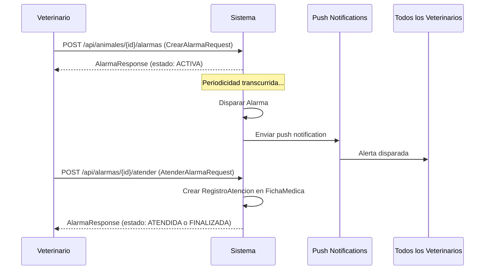
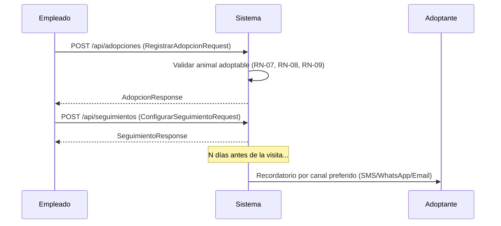

# Functional Spec — Gud Boys (Refugio Animal)
> Version: 1.3 | Fecha: 2026-06-30 | Estado: Draft
>
> **Changelog v1.3:** CU-04 (Disparar alarma) actualizado a ✅ — el disparo automático está implementado (`AlarmaScheduler` + `GestionAlarmaService.dispararAlarmasVencidas()` + Observer). RN-05 actualizado a ✅. Tablas de estado de implementación en [§10](#10-estado-de-implementación) actualizadas.
>
> **Changelog v1.2:** Incorporado el diagrama UML actualizado (`PDS-TP.mdj`). CU-02 (Exportar ficha) ahora contempla **encriptado** y **marca de agua** (patrón Decorator); nueva regla **RN-15**. El detalle técnico de los patrones de diseño está en la sección 15 de la spec técnica.
>
> **Changelog v1.1:** Se marca el estado de implementación de cada caso de uso y regla de negocio (verificado contra el código al 2026-06-22). Nueva sección [10](#10-estado-de-implementación) con el resumen y la justificación de lo cumplido. Leyenda usada en este documento: ✅ Implementado · ⚠️ Parcial · ❌ Pendiente.

## 1. Propósito y Resumen

**Gud Boy** es una cadena de refugios animales que necesita un sistema para:
- Gestionar el ingreso y seguimiento médico de animales (domésticos y salvajes)
- Administrar alarmas de control veterinario y tratamientos
- Manejar el proceso de adopción de animales domésticos
- Coordinar visitas de seguimiento post-adopción

El sistema interactúa con un módulo externo de autenticación (no gestionado por este equipo) y con servicios de notificación (push, SMS, WhatsApp, email).

---

## 2. Usuarios y Actores

| Actor | Descripción |
|-------|-------------|
| **Veterinario** | Crea alarmas, atiende alertas, completa fichas médicas |
| **Visitador** | Realiza visitas domiciliarias post-adopción, completa encuestas |
| **Sistema de Autenticación (externo)** | Gestiona login/registro de usuarios. Nuestro sistema solo guarda una referencia (`externalId`) |
| **Adoptante** | Cliente que adopta un animal doméstico (no tiene acceso al sistema en sí) |
| **Sistema de Notificaciones (externo)** | Firebase (push), SMS, WhatsApp, Email |

---

## 3. Casos de Uso

### CU-01 — Ingresar Animal al Refugio ✅
**Estado:** Implementado — `IngresoAnimalService.ingresarAnimal`. Valida el tipo (`DOMESTICO`/`SALVAJE`, si no lanza `AnimalException`), mapea con `AnimalMapper` al subtipo correcto, crea automáticamente una `FichaMedica` vacía asociada y persiste todo por cascade. Endpoint `POST /api/animales` activo en `AnimalController`.
**Actor:** Veterinario  
**Descripción:** Se registra un animal nuevo con su ficha técnica y médica inicial.

**Flujo:**
1. El veterinario carga los datos del animal: tipo (doméstico/salvaje), especie, altura, peso, edad aproximada, condición médica.
2. El sistema crea la entidad `Animal` correspondiente (`AnimalDomestico` o `AnimalSalvaje`).
3. El sistema genera automáticamente una `FichaMedica` vacía asociada al animal.
4. El sistema persiste el animal y devuelve confirmación.

**Reglas de negocio:** RN-01, RN-02

---

### CU-02 — Exportar Ficha Médica ❌
**Estado:** Pendiente — la interfaz `IExportadorStrategy` y las clases `ExportadorPDF`/`ExportadorExcel` existen, pero sus métodos `exportar()` lanzan `UnsupportedOperationException`. No hay endpoint de exportación en `AnimalController` ni dependencias de PDF/Excel (iText/POI) en el `pom.xml`. Depende de los patrones **Strategy + Decorator + Factory** de exportación.
**Actor:** Veterinario  
**Descripción:** Se exporta la ficha médica de un animal en PDF o Excel, con opciones de encriptado y marca de agua.

**Flujo:**
1. El veterinario selecciona un animal, el formato de exportación (PDF o Excel) y, opcionalmente, si quiere **encriptar** el archivo y/o agregarle **marca de agua** (RN-15).
2. El sistema (vía `ExportadorFactory`) arma el exportador del formato elegido (Strategy) y lo envuelve con los decoradores pedidos (`EncriptarDecorator`, `MarcaAguaDecorator`).
3. El sistema retorna el archivo exportado.

**Reglas de negocio:** RN-03, RN-15  
**Nota:** El diseño permite agregar nuevos formatos sin modificar la lógica existente (Strategy) y combinar transformaciones de salida sin multiplicar clases (Decorator), seleccionando todo desde un punto único (Factory). Ver §15.3 de la spec técnica.

---

### CU-03 — Crear/Actualizar Alarma de Control ✅
**Estado:** Implementado — `GestionAlarmaService` (`crearAlarma`, `actualizarAlarma` con `@Transactional` y actualización in-place vía `AlarmaMapper.actualizarEntity`, `listarAlarmasPorAnimal`). La alarma se crea con estado `ACTIVA` (seteado en `AlarmaMapper`). Endpoints `POST`/`GET /api/animales/{animalId}/alarmas` y `PUT /api/alarmas/{id}` activos.
**Actor:** Veterinario  
**Descripción:** Se programa una alarma periódica de control para un animal.

**Flujo:**
1. El veterinario selecciona un animal y configura una alarma.
2. Configura: periodicidad (en días), si es tratamiento médico activo, y las acciones a ejecutar (de entre las 5 disponibles).
3. El sistema guarda la alarma asociada al animal con estado `ACTIVA`.

**Reglas de negocio:** RN-04, RN-07  
**Acciones posibles:** Control de parásitos, Colocar antiparasitarios, Comprobar peso y tamaño, Chequear nutrición, Colocar vacuna.

---

### CU-04 — Disparar y Atender Alarma ✅
**Estado:** Completamente implementado.
- **Atención (pasos 3-8): ✅** `AtencionAlarmaService.atenderAlarma`: valida alarma/veterinario/ficha, crea el `RegistroAtencion` con descripción Composite de las acciones, lo agrega a la ficha médica, transiciona el estado vía **State** (`alarma.getEstado().atender(...)`), y marca las alertas pendientes como atendidas. Endpoint `POST /api/alarmas/{id}/atender` activo. *Pendiente menor:* usa `RuntimeException` genérica.
- **Disparo (pasos 1-2): ✅** `AlarmaScheduler` detecta alarmas vencidas por `fechaProximoDisparo` y llama `GestionAlarmaService.dispararAlarmasVencidas()`, que genera la `Alerta`, suscribe veterinarios + canal push vía **Observer** y llama `alerta.alertarVeterinarios()`. `FirebasePushNotification` loguea la notificación (simulado).
**Actor:** Sistema (disparo automático), Veterinario (atención)  
**Descripción:** Al llegar el momento de una alarma, el sistema genera una alerta para todos los veterinarios.

**Flujo:**
1. El sistema detecta que una alarma está vencida y la dispara.
2. Se genera una `Alerta` y se envía push notification a **todos** los veterinarios [Observer].
3. Cualquier veterinario puede atender la alarma.
4. El veterinario marca las acciones como completadas con un comentario.
5. Si es tratamiento médico, indica si finalizó o no.
6. Se crea un `RegistroAtencion` (evento en la ficha médica).
7. La alarma pasa a estado `ATENDIDA`.
8. Si el tratamiento finalizó, la alarma pasa a `FINALIZADA` y el animal queda libre para adopción.

**Reglas de negocio:** RN-04, RN-05, RN-06, RN-07

---

### CU-05 — Registrar Adopción ✅
**Estado:** Implementado — `AdopcionService.registrarAdopcion`. Valida que el animal sea adoptable (`animal.esAdoptable()` → RN-08) y que no esté bajo tratamiento activo (`ficha.estaBajoTratamientoActivo()` → RN-07), valida el límite de 2 adopciones por adoptante (RN-09), incrementa el contador del adoptante y persiste la `Adopcion`. Endpoints `POST`/`GET /api/adopciones` y `GET /api/adopciones/{id}` activos.
**Actor:** Veterinario / Empleado del refugio  
**Descripción:** Se registra la adopción de un animal doméstico.

**Flujo:**
1. Se cargan los datos del adoptante (nombre, apellido, estado civil, email, teléfono, ocupación, si tiene mascotas, motivo, tipos de animales interesados).
2. Se selecciona el animal doméstico a adoptar.
3. El sistema valida que el animal sea adoptable (RN-08, RN-09).
4. Se completan los papeles de adopción.
5. Se crea el registro de `Adopcion`.

**Reglas de negocio:** RN-08, RN-09, RN-10

---

### CU-06 — Configurar Seguimiento de Visitas ✅
**Estado:** Implementado — `VisitaSeguimientoService.configurarSeguimiento` (`@Transactional`). Valida visitador y adopción, impide más de un seguimiento por adopción (`findByAdopcionId`), mapea y persiste el `SeguimientoVisitas` con visitador, cadencia (día/horario) y preferencia de recordatorio. Endpoint `POST /api/seguimientos` activo. *Nota:* la preferencia de recordatorio se persiste, pero el envío en sí es CU-08 (pendiente).
**Actor:** Veterinario / Empleado  
**Descripción:** Post-adopción, se configura el seguimiento de visitas domiciliarias.

**Flujo:**
1. Se asocia un `Visitador` responsable del seguimiento.
2. Se define la cadencia de visitas (día y rango horario).
3. Se configura la preferencia de recordatorio (SMS, WhatsApp o Email).
4. El sistema guarda el `SeguimientoVisitas`.

**Reglas de negocio:** RN-11, RN-12

---

### CU-07 — Registrar Visita Domiciliaria ✅
**Estado:** Implementado — `VisitaSeguimientoService.registrarVisita` y `listarVisitas` (`@Transactional`). Mapea la `VisitaDomicilio` con su `EncuestaSeguimiento` (estado animal, limpieza, ambiente) y el flag `continuar_visitas`, la agrega a la lista de visitas del seguimiento y persiste por cascade. Como `VisitaDomicilio` extiende `Evento`, queda enlazada también a la ficha médica (RN-14). Endpoints `POST`/`GET /api/seguimientos/{id}/visitas` activos.
**Actor:** Visitador  
**Descripción:** El visitador realiza la visita y registra los resultados.

**Flujo:**
1. El visitador completa la encuesta de seguimiento (estado del animal, limpieza del lugar, ambiente).
2. Indica si se deben continuar las visitas o no.
3. Se crea un registro de `VisitaDomicilio` con la `EncuestaSeguimiento` y se agrega al historial del animal (ficha médica).

**Reglas de negocio:** RN-13, RN-14

---

### CU-08 — Enviar Recordatorio de Visita ❌
**Estado:** Pendiente — `VisitaSeguimientoService.enviarRecordatoriosProximos` lanza `UnsupportedOperationException`. La interfaz `IRecordatorioStrategy` y los senders `SmsSender`/`WhatsAppSender`/`EmailSender` existen pero son stubs. No hay scheduler que dispare el envío. El parámetro `N` ya está configurado (`gudboys.recordatorio.dias-anticipacion=3`). Depende del patrón **Strategy** de recordatorios + scheduler.
**Actor:** Sistema (automático)  
**Descripción:** El sistema envía recordatorios 'N' días antes de cada visita.

**Flujo:**
1. El sistema calcula las visitas próximas dentro de los próximos 'N' días (configurable por parámetro).
2. Para cada visita próxima, envía recordatorio al adoptante y al visitador según la preferencia elegida (SMS, WhatsApp o Email).

**Reglas de negocio:** RN-12  
**Nota:** El canal de notificación es seleccionable por Strategy [IRecordatorioStrategy].

---

## 4. Reglas de Negocio

### RN-01 — Tipos de Animal ✅
Los animales se clasifican en **Doméstico** (perro, gato, canario, loro, tortuga, etc.) o **Salvaje** (zorro, pingüino, halcón, etc.). Esta clasificación determina si pueden ser adoptados.  
*Cumplida:* modelada con herencia JPA `AnimalDomestico`/`AnimalSalvaje` sobre la clase abstracta `Animal`; `IngresoAnimalService` instancia el subtipo según el `tipoAnimal` del request.  
*Referenciado por: CU-01, CU-05*

### RN-02 — Ficha Técnica Obligatoria ✅
Todo animal que ingresa al refugio debe tener altura, peso, edad aproximada y condición médica inicial.  
*Cumplida:* el `IngresarAnimalRequestDTO` exige estos campos vía Jakarta Validation (`@Valid` en `AnimalController`) y las columnas son `nullable=false` en la entidad `Animal`.  
*Referenciado por: CU-01*

### RN-03 — Escalabilidad en Exportación ❌
El sistema debe soportar la exportación de fichas médicas a PDF y Excel, con capacidad de agregar nuevos formatos sin modificar código existente.  
*Pendiente:* el contrato `IExportadorStrategy` está definido (preparado para Strategy), pero las implementaciones `ExportadorPDF`/`ExportadorExcel` son stubs. No se cumple funcionalmente hasta implementar el patrón.  
*Referenciado por: CU-02*

### RN-04 — Alarma con Acciones ✅
Cada alarma tiene una periodicidad (en días) y un conjunto de acciones a ejecutar. Las acciones posibles son: Control de parásitos, Colocar antiparasitarios, Comprobar peso y tamaño, Chequear nutrición, Colocar vacuna.  
*Cumplida:* `Alarma` tiene `periodicidad` (int días) y `List<AccionAlarma>` (`@ElementCollection`); el enum `AccionAlarma` define las 5 acciones. `GestionAlarmaService` las persiste vía `AlarmaMapper`.  
*Referenciado por: CU-03, CU-04*

### RN-05 — Notificación a Veterinarios ✅
Cuando se dispara una alarma, se envía una push notification a **todos** los veterinarios del sistema.  
*Cumplida:* `GestionAlarmaService.generarAlerta()` suscribe a todos los veterinarios y a `FirebasePushNotification` como observadores de la `Alerta`. `alerta.alertarVeterinarios()` notifica a cada uno. La notificación push es simulada por log (suficiente para el TP).  
*Referenciado por: CU-04*

### RN-06 — Registro de Atención ✅
Cuando un veterinario atiende una alarma, debe dejar un comentario/registro de lo realizado. Si es tratamiento médico, debe indicar si finalizó.  
*Cumplida:* `AtencionAlarmaService` crea un `RegistroAtencion` con `comentario`, `accionesRealizadas`, `tratamientoFinalizado` y el veterinario, y lo guarda en la ficha médica.  
*Referenciado por: CU-04*

### RN-07 — Estado del Tratamiento y Adopción ✅
Un animal bajo tratamiento médico activo (alarma de tipo tratamiento en estado ACTIVA o ATENDIDA sin finalizar) **no puede ser adoptado**. Solo puede adoptarse cuando el tratamiento finaliza.  
*Cumplida:* `FichaMedica.estaBajoTratamientoActivo()` y `AnimalDomestico.esAdoptable()` revisan si hay alguna alarma de tratamiento en estado `ACTIVA`/`ATENDIDA`; `AdopcionService` bloquea la adopción si es el caso. *Nota de diseño:* hoy se resuelve con el enum `EstadoAlarma` plano (sin el patrón **State**, todavía pendiente).  
*Referenciado por: CU-04, CU-05*

### RN-08 — Solo Domésticos son Adoptables ✅
Los animales salvajes **nunca** pueden ser adoptados, independientemente de su estado médico.  
*Cumplida:* `esAdoptable()` es un método abstracto de `Animal`; `AnimalSalvaje` lo sobreescribe devolviendo `false` siempre (polimorfismo), y `AdopcionService` lo valida antes de adoptar.  
*Referenciado por: CU-05*

### RN-09 — Límite de Adopciones por Adoptante ✅
Cada adoptante puede adoptar un **máximo de 2 animales** domésticos.  
*Cumplida:* `AdopcionService` rechaza la adopción si `adoptante.getCantAnimalesAdoptados() >= 2` e incrementa el contador al concretar cada adopción.  
*Referenciado por: CU-05*

### RN-10 — Datos del Adoptante ✅
Al registrar una adopción se requiere: nombre, apellido, estado civil, email, teléfono, ocupación (empleado/estudiante/otros), si tiene otras mascotas, motivo de adopción y tipos de animales de interés.  
*Cumplida:* el `RegistrarAdopcionRequestDTO` recibe todos estos datos y `AdopcionMapper.toAdoptanteEntity` los mapea a la entidad `Adoptante` (ocupación como enum `Ocupacion`).  
*Referenciado por: CU-05*

### RN-11 — Asignación de Visitador ✅
Todo seguimiento post-adopción debe tener un visitador responsable asignado.  
*Cumplida:* `configurarSeguimiento` valida que el `visitadorId` exista antes de crear el seguimiento, y el `SeguimientoVisitas` referencia obligatoriamente al `Visitador`.  
*Referenciado por: CU-06*

### RN-12 — Recordatorio Configurable ⚠️
El sistema envía recordatorios 'N' días antes de cada visita (N es configurable por parámetro en application.properties). Los canales disponibles son SMS, WhatsApp y Email.  
*Parcial:* la **configuración** está lista — el parámetro `N` existe (`gudboys.recordatorio.dias-anticipacion=3`), la preferencia de canal se persiste (enum `PreferenciaRecordatorio` en `SeguimientoVisitas`) y los 3 senders existen como Strategy. El **envío** en sí (CU-08) está pendiente.  
*Referenciado por: CU-06, CU-08*

### RN-13 — Encuesta de Visita ✅
Cada visita domiciliaria incluye una encuesta con tres ítems calificados como MALO/REGULAR/BUENO: estado general del animal, limpieza del lugar, ambiente.  
*Cumplida:* `EncuestaSeguimiento` tiene `estadoGeneral`, `limpiezaLugar` y `ambiente` como enum `Calificacion` (BUENO/REGULAR/MALO); `registrarVisita` la crea junto a la `VisitaDomicilio`.  
*Referenciado por: CU-07*

### RN-14 — Historial Unificado ✅
Todos los eventos del animal (registros de atención veterinaria y visitas domiciliarias) quedan en el historial de la ficha médica del animal, enlazados cronológicamente.  
*Cumplida:* tanto `RegistroAtencion` como `VisitaDomicilio` extienden `Evento` (herencia JOINED) y `FichaMedica.eventos` es `List<Evento>` ordenada por `fechaHora ASC`. Ver [TD-05] en la spec técnica.  
*Referenciado por: CU-04, CU-07*

### RN-15 — Opciones de Exportación: Encriptado y Marca de Agua ❌ (nueva, v1.1)
La exportación de la ficha médica puede, opcionalmente, **encriptar** el archivo resultante y/o agregarle una **marca de agua**. Estas opciones son combinables (ninguna, una, o ambas) e independientes del formato (PDF/Excel).  
*Pendiente:* introducida por el diagrama UML actualizado (`PDS-TP.mdj`) mediante el patrón **Decorator** (`EncriptarDecorator`, `MarcaAguaDecorator`) sobre el `IExportadorStrategy`, orquestado por `ExportadorFactory`. No implementada en código. Ver §15.3 de la spec técnica.  
*Referenciado por: CU-02*

---

## 5. Flujos Principales

---

## 6. Estados de la Alarma

| Estado | Descripción | Transición |
|--------|-------------|------------|
| `ACTIVA` | Alarma programada y vigente. Bloquea adopción si es tratamiento. | → ATENDIDA (al ser atendida) |
| `ATENDIDA` | Fue atendida pero el tratamiento no finalizó. Sigue bloqueando adopción. | → FINALIZADA (al indicar fin de tratamiento) |
| `FINALIZADA` | Tratamiento completo o control sin tratamiento. No bloquea adopción. | (estado terminal) |

---

## 7. Fuera de Alcance

- Login y registro de usuarios (responsabilidad del módulo de autenticación externo).
- Gestión de permisos y roles (responsabilidad del módulo de seguridad externo).
- Pasarela de pagos u honorarios de adopción.
- Gestión de inventario de medicamentos o insumos.
- Aplicación mobile (solo backend/API REST).

---

## 8. Glosario del Dominio

| Término | Definición |
|---------|------------|
| **Animal Doméstico** | Animal que puede ser adoptado (perro, gato, canario, loro, tortuga, etc.) |
| **Animal Salvaje** | Animal rescatado pero no adoptable (zorro, pingüino, halcón, etc.) |
| **Ficha Médica** | Historial médico completo del animal: eventos, tratamientos, visitas |
| **Alarma** | Control periódico programado por un veterinario para un animal |
| **Alerta** | Notificación generada cuando una alarma se dispara |
| **RegistroAtencion** | Evento en la ficha médica que documenta la atención de una alarma |
| **Adoptante** | Cliente externo que adopta un animal |
| **SeguimientoVisitas** | Configuración del seguimiento post-adopción |
| **VisitaDomicilio** | Una visita concreta al hogar del adoptante |
| **EncuestaSeguimiento** | Evaluación de la visita (estado animal, limpieza, ambiente) |
| **ExternalId** | Referencia al usuario en el sistema de autenticación externo |

---

## 9. Supuestos a Validar

- [ ] ¿El disparo de alarmas es automático (job scheduler) o manual (el veterinario dispara)?
- [ ] ¿El `externalId` del usuario es un UUID o un entero? ¿Qué formato usa el módulo de autenticación?
- [ ] ¿El adoptante recibe acceso al sistema o solo es un registro de datos?
- [ ] ¿El parámetro 'N' de recordatorios es global o configurable por adopción?
- [ ] ¿Puede un veterinario crear múltiples alarmas para el mismo animal simultáneamente?
- [ ] ¿Las visitas domiciliarias tienen una fecha programada de antemano o son flexibles?

---

## 10. Estado de Implementación
> Verificado contra el código al 2026-06-30. Leyenda: ✅ Implementado · ⚠️ Parcial · ❌ Pendiente.

### Casos de Uso

| CU | Caso de uso | Estado | Falta |
|----|-------------|--------|-------|
| CU-01 | Ingresar animal | ✅ | — |
| CU-02 | Exportar ficha médica | ❌ | Strategy + Decorator + Factory + endpoint + deps PDF/Excel |
| CU-03 | Crear/actualizar alarma | ✅ | — |
| CU-04 | Disparar y atender alarma | ✅ | — |
| CU-05 | Registrar adopción | ✅ | — |
| CU-06 | Configurar seguimiento | ✅ | — |
| CU-07 | Registrar visita | ✅ | — |
| CU-08 | Enviar recordatorio | ❌ | Strategy de recordatorio + scheduler |

### Reglas de Negocio

| RN | Estado | RN | Estado |
|----|--------|----|--------|
| RN-01 Tipos de animal | ✅ | RN-08 Solo domésticos adoptables | ✅ |
| RN-02 Ficha técnica obligatoria | ✅ | RN-09 Límite 2 adopciones | ✅ |
| RN-03 Escalabilidad exportación | ❌ | RN-10 Datos del adoptante | ✅ |
| RN-04 Alarma con acciones | ✅ | RN-11 Asignación de visitador | ✅ |
| RN-05 Notificación a veterinarios | ✅ | RN-12 Recordatorio configurable | ⚠️ |
| RN-06 Registro de atención | ✅ | RN-13 Encuesta de visita | ✅ |
| RN-07 Tratamiento bloquea adopción | ✅ | RN-14 Historial unificado | ✅ |
| | | RN-15 Encriptado / marca de agua | ❌ |

**Resumen:** 7 de 8 casos de uso completos. 12 de 15 reglas cumplidas (RN-12 parcial; RN-03, RN-15 pendientes). Lo pendiente (CU-02, CU-08, RN-03, RN-15) se concentra en los **patrones de exportación y recordatorios**. Ver §12 y §14 de la spec técnica.
